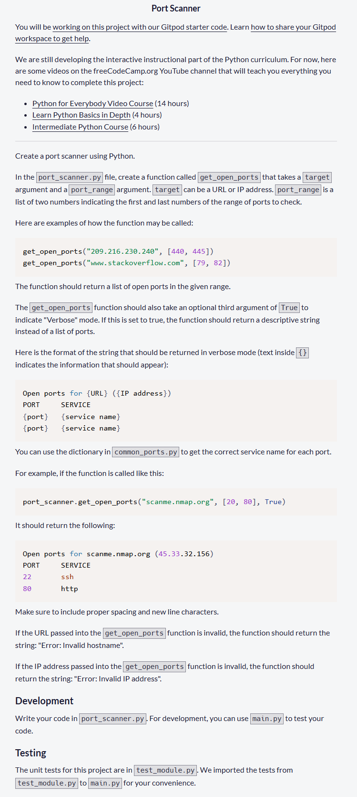
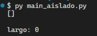
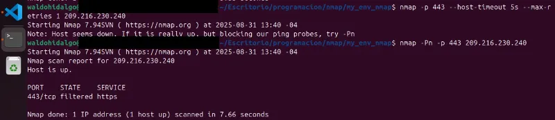
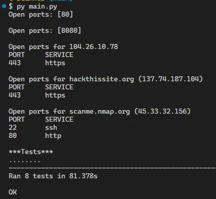
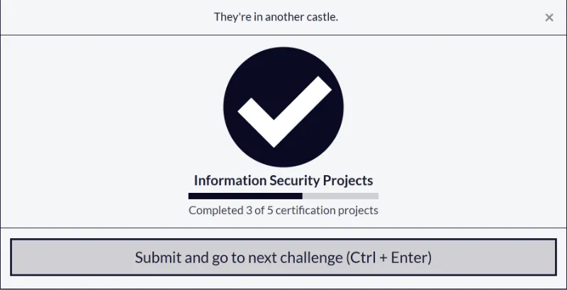

# Port Scanner

Código solución del tercer proyecto requisito obligatorio para obtener la **Information Security Certification** de freecodecamp. Se requiere construir una herramienta que permita el escaneo de puertos abiertos dado un hostname o una IP.

## Tabla de Contenidos

- [Port Scanner](#port-scanner)
  - [Tabla de Contenidos](#tabla-de-contenidos)
  - [Requisitos](#requisitos)
  - [Código Solución](#código-solución)
    - [Validación de Target (hostname o IP)](#validación-de-target-hostname-o-ip)
    - [Obtención de hostname si existe o IP](#obtención-de-hostname-si-existe-o-ip)
    - [Versión 1](#versión-1)
    - [Versión 2](#versión-2)
  - [Test Aprobados](#test-aprobados)
  - [Proyecto Aprobado](#proyecto-aprobado)

## Requisitos

Los requisitos del proyecto son los siguientes:



## Código Solución

He construido dos soluciones válidas. La primera utiliza la librería **nmap** y la segunda solo utiliza la librería **socket**. Ambas soluciones utilizan estas dos funciones auxiliares:

### Validación de Target (hostname o IP)

Esta función permite retornar errores específicos en función del valor de target. Utilizando una expresión regular sencilla se permite identificar si **target** cumple con una estructura de IP y si es así se valida o se retorna un mensaje de error del tipo `Invalid IP address`

```py
def validar_target(target: str) -> dict:
    ip_pattern = r"^(\d\.*)+$"
    if re.match(ip_pattern, target):
        try:
            ipaddress.ip_address(target)
            return {"ip":target,"error":None}
        except ValueError:
            return {"ip":None,"error":"Error: Invalid IP address"}
    else:
        try:
            ip=socket.gethostbyname(target)
            return {"ip":ip,"error":None}
        except socket.gaierror:
            return {"ip":None,"error":"Error: Invalid hostname"}
```

### Obtención de hostname si existe o IP

```py
def get_name_or_ip(ip: str) -> str:
    try:
        host, _, _ = socket.gethostbyaddr(ip)
        return host
    except socket.herror:
        return ""
```

### Versión 1

Esta versión utiliza la librería **nmap**:

```py
def get_open_ports(target, port_range, verbose = False):
    open_ports = []

    validacionObj = validar_target(target)

    if(validacionObj["ip"] == None):
        return validacionObj["error"]

    ip_address = validacionObj["ip"]
    scanner = nmap.PortScanner()

    port_str = f"{port_range[0]}-{port_range[1]}"


    try:

        scanner.scan(hosts=ip_address, ports=port_str, arguments='-sT')

        if ip_address in scanner.all_hosts():
            for proto in scanner[ip_address].all_protocols():
                ports = scanner[ip_address][proto].keys()
                for port in ports:
                    if scanner[ip_address][proto][port]['state'] == 'open':
                        open_ports.append(port)

            open_ports.sort()

    except scanner.PortScannerError as e: # type: ignore
        return f"Error with nmap scan: {str(e)}"
    except Exception as e:
        return f"Unexpected error: {str(e)}"

    if not verbose:
        return open_ports

    '''
    template
    Open ports for {URL} ({IP address})
    PORT     SERVICE
    {port}   {service name}
    {port}   {service name}
    '''


    ports_str = "\n".join(f"{port:<9}{ports_and_services[port]}" for port in open_ports)


    hostname=get_name_or_ip(target)

    return f"Open ports for {f'{hostname} ({ip_address})' if hostname else ip_address}\nPORT     SERVICE\n{ports_str}"

```

### Versión 2

Esta versión solo utiliza la librería **socket**:

```py
def get_open_ports(target, port_range, verbose = False):
    open_ports = []

    validacionObj = validar_target(target)

    if validacionObj["ip"] is None:
        return validacionObj["error"]

    ip_address = validacionObj["ip"]


    for port in range(port_range[0], port_range[1]+1):
        sock = socket.socket(socket.AF_INET, socket.SOCK_STREAM)
        sock.settimeout(0.5)
        result = sock.connect_ex((ip_address, port))

        if result == 0:
            open_ports.append(port)
        sock.close()

    if not verbose:
        return open_ports

    ports_str = "\n".join(
        f"{port:<9}{ports_and_services.get(port, 'unknown')}" for port in open_ports
    )

    hostname = get_name_or_ip(ip_address)

    return f"Open ports for {f'{hostname} ({ip_address})' if hostname else ip_address}\nPORT     SERVICE\n{ports_str}"
```

## Test Aprobados

Se necesitan aprobar 8 tests unitarios. El primer test unitario es el siguiente:

```py
    def test_port_scanner_ip(self):
        ports = port_scanner.get_open_ports("209.216.230.240", [440, 445], False)
        actual = ports
        expected = [443]
        self.assertEqual(actual, expected, 'Expected scanning ports of IP address to return [443].')
```

A la fecha de hoy, 31 de agosto de 2025, el puerto 443 de la ip "209.216.230.240" esta **filtrado** lo cual se prueba al ejecutar la aplicación de manera aislada para dicha URL obteniendose una lista vacia de puertos abiertos en el rango 440-445:

```py
import port_scanner_v2 as port_scanner

ports = port_scanner.get_open_ports("209.216.230.240", [440, 445], False)
print(ports, "\n")

print("largo:", len(ports))
```

Mostrándose esto:



Para verificar que el puerto esta filtrado he ejecutado lo siguiente:



Dado que el puerto esta filtrado entonces he modificado el test cambiando el expected a una lista vacía y en este caso es posible aprobar todos los test unitarios:



## Proyecto Aprobado


